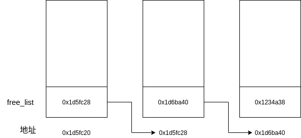

[TOC]

# C++——STL篇

## 简介

什么是STL？

简单来说，是C++语言中，为了提高代码的复用性而加入的标准模板库(Standard Template Library)。STL不仅提供了常用的数据结构（如栈、数组等）还提供了一些常用算法。因此熟练使用STL库可以提高编程效率，减少出错可能，美观代码，更好地使用C++完成一些高难度任务，而不是忙于造轮子。

STL有六大组件

- 容器(Containers) 各种各样的数据结构，有顺序的（如vector、list、array），也有组合式的（如set、map）也有非顺序的（如unordered_set）有不同的功能，适用于不同的场合，但本质就是class template
- 算法(Algorithms) 提供各种常用算法，比如sort、search、copy等
- 迭代器(Iterators) 可以把迭代器理解成一个万能的指针，它们都实现了指针相关的运算，如`operator*`、`operator->`，几乎所有的STL容器都有自己的迭代器，用于遍历自己的元素。
- 仿函数(functors) 这是一种重载了`operator()`的class或者class template，可以理解为一种高级的函数指针。
- 配接器(Adapters) 有时候，配接器被归在了容器内部，但其实配接器有些不同于容器，如queue、stack，它们的底层事实上都完全借助deque实现。
- 配置器(allocators) 用于分配内存空间，负责管理空间配置的class template

我对仿函数的理解不够深刻，一开始甚至不懂仿函数是在干什么，这里有个[例子](../src/STL/introduction)：

```C++
template<class T>
class print {
public:
    void operator() (const T & elem) {
        cout << elem << endl;
    };
};

int main(int argc, char const *argv[])
{
    vector<int> a{1,2,3,4,5};
    for_each(a.begin(), a.end(), print<int>());
}
```

这里的`class print`就是仿函数，重载了`operator()`的class template。这里最后一行，就是用`print<int>`的一个临时对象，传入到`for_each()`中，进行打印操作，用法非常类似于函数指针。

那么，仿函数与函数指针的区别在哪里呢？首先，仿函数是一个对象，对象就可以有自己的内部状态，可以根据自身的状态不同来作出不同的反应，这是函数指针做不到的。比如之前的例子中，若`print`类中再添加一个成员变量，根据成员变量的数值来决定输出格式，这是函数指针做不到的。当然你可以说函数指针使用静态变量来完成，但静态变量又有可能被其他程序修改导致不确定性，封装也没有对象好。其次，编译器可以内联(inline)仿函数，而函数指针不能这样，因此效率会高一些。

## 配置器

### 设计一个简单的空间配置器

根据STL规范，`allocator`必须有以下接口

- allocate() 函数，用于分配内存空间
- deallocate() 函数，用于收回内存空间
- construct() 函数，用于构建对象
- destroy() 函数，用于析构对象
- address() 函数用于返回对象的地址
- rebind() 函数

外加上一些构造函数和析构函数，以及STL规范中要求的traits特性。从[示例](../src/STL/alloc)中可以看出各个函数的功能实现。

一般而言，常用的C++内存配置操作时这样的。

```C++
class Abc { ... };
Abc* pf = new Abc;	// 配置内存 构造对象
delete pf;			// 析构对象 释放内存
```

这其中，`new`事实上做了两步操作：1、调用`::operator new`配置内存。2、调用`Abc()`构造对象。`delete`也做了两步操作：1、调用`~Abc()`函数析构对象。2、调用`::operator delete`释放内存。

现在STL将这两步分开，内存配置由`allocator::allocate()`完成，构造对象由`::construct`完成，内存释放由`allocator::deallocate()`完成，析构对象由`::destroy()`完成。

### 关于空闲块链表

STL作为一个C++标准库，效率是非常关键的指标。理解STL源码，必须要理解为什么STL有这么高的运行效率，理解为提升效率编写者的良苦用心。

回归正题，小额区块带来的内存碎片是非常头疼的，系统不仅要配置并维护内存碎片，而且还需要额外的空间去管理记录，这都是很沉重的管理负担。内存碎片的存在还会使得内存利用不充分，浪费宝贵的内存空间。

为解决（或者说缓解）这一问题，SGI STL实现了二级配置器，二级配置器从内存池中索要分配空间，并将空闲的块用**自由链表**维护。这相当于给所有的内存碎片用链表串起来，在遇到一些符合要求的内存需求时，直接从链表中拨出，这样可以充分利用内存碎片，也就提高了效率。

维护链表时，为了进一步减少额外负担，采用如下数据结构：

```C++
union obj {
    union obj * free_list_link;
    char client_data[1];
};
```

如此一来，每个`obj`事实上只占用了8个字节（64位下），若一个块64字节，那么只有头8字节被赋值，指向了下一个块的地址（见下图），当分配块时，直接就将头部的64字节返回，并将free_list指针指向第二个块。



从第一个字段看，只需要使用`free_list_link`指针就可以指向下一个`obj`，而从第二个字段看，可以被视作一个指针，指向实际区块。但是这么一个简陋的节点，究竟是怎样链接在一起的？

在分配(allocate)时，只需要从链表头部拿走一个块，然后把新头部定在`free_list_link`就行。

```C++
my_free_list = free_list + FREELIST_INDEX(n);
result = *my_free_list;
if (result == 0) {
   void *p = refill(n);
   return p;
}
*my_free_list = result->free_list_link;
```

在回收(deallocate)空间时，将回收到的块插入到链表头部就行。

```C++
// p 指针指向被回收的块   n是指针指向块的大小
obj * q = (obj *)p;

my_free_list = free_list + FREELIST_INDEX(n);
q->free_list_link = *my_free_list;
*my_free_list = q;
```

若链表中没有了空闲块，那么就需要从堆中或从内存池中分配一些空间，使用`refill()`函数就可以做到。

```C++
void* refill(size_t n)
{
    obj * volatile * my_free_list = free_list+ FREELIST_INDEX(n);
    obj * next_obj, * current_obj;
    char * chunk = (char *)malloc(n*4);		// 直接从堆中 malloc
    obj * result = (obj *)chunk;

    // 首先让 next_obj 和 my_free_list 指向第二个chunk
    *my_free_list = next_obj = (obj *)(chunk + n);
    for(int i = 1; ; i++) {
        current_obj = next_obj;
        next_obj = (obj *)((char *)next_obj + n);
        if (i == 3) {
            // 最后为 0
            current_obj->free_list_link = 0;
            break;
        } else {
            // 首尾相连接
            current_obj->free_list_link = next_obj;
        }
    }
    return result;
}
```

上述代码做了简化，`chunk`的内存空间是直接通过`malloc()`从堆中获取的，但是事实上SGI STL还在二级配置器中维护了内存池，先从内存池中取出内存空间，若内存池空间不足，在从堆中获取。

## 迭代器与traits编程

​	迭代器在STL的实际应用中发挥着重要的作用，STL的思想在于将数据容器(containers)和算法(algorithms)分开，彼此独立设计，然后用迭代器(iterator)将它们撮合在一起。对迭代器的理解，一种非常粗糙但有效的方法是，把它们都认为是一种智能指针(smart pointer)。因为迭代器的基本功能就是完成了对`operator*`（内容提领dereference）和`operator->`（成员访问member access）的重载。当然大多数迭代器也有对`operator++`和`operator--`的重载。

### 萃取初识

​	除了上述的这些功能外，迭代器还提供了一个重要的功能：提取型别。在使用迭代器时，很有可能会用到迭代器所指之物的型别。然而C++只支持`sizeof()`，不支持`typeof()`。

​	但这并不表明C++无法做到。利用模板偏特化以及`typedef`，一样可以精确地获得迭代器指向之物的型别。

```C++
// “萃取” 机制
template<class I>
struct iterator_traits {
	typedef typename I::value_type	value_type;
};

// MyIter
template<class T>
struct MyIter {
  	typedef T value_type;
  	T *ptr;
    // ...
};


template<class I>
typename iterator_traits<I>::value_type	// 这一行便是 提取出来的型别 作为函数的返回类型
    func(I iter) {
    // ...
}

// 当调用函数时
MyIter<T> iter;
func(iter);	// 返回值的类型就是 T
```

咋一看有点复杂，但慢慢整理就会发现其中的奥秘：

- 首先，`func(iter)`被调用，`template<class I>`中的`I`就是`MyIter`
- 传入到`iterator_traits<I>::value_type`，而根据`iterator_traits`类内部的`typedef`，返回值类型就是`I::value_type`
- 即`MyIter::value_type`，而再根据`typedef`，就明白它指的就是类型`T`。Congratulations，这就是我们要的类型。

当然，你可能会问，万一遇到了原生指针的情况呢？毕竟，不是所有的迭代器都是class type。如果不是class type，就无法定义内嵌的型别了！

这时候模板偏特化就派上用场了：

```C++
template<class I>
typename iterator_traits<I*> {	// 偏特化版，当传入的类型是原生指针，就会使用这个情况
    typedef I value_type;
}
```

与上述情况类似，当遇到了指向常数的指针时，我们也可以这么干：

```C++
template<class I>
typename iterator_traits<const I*> {	// 偏特化版，很多时候，我们可不希望得到一个无法赋值的东西
    typedef I value_type;
}
```

在SGI STL中，这类技巧几乎被用到了极致！

### 迭代器的五种相应型别

```C++
template<class T>
struct iterator_traits {
    typedef typename I::iterator_category	iterator_category;
    typedef typename I::value_type			value_type;
    typedef typename I::difference_type		difference_type;
    typedef typename I::pointer				pointer;
    typedef typename I::reference			reference;
};
```

如果你希望你所开发的容器能与STL兼容，那么一定不能忘记，要为你开发的容器的迭代器定义这五种型别。当然，为了正确，还需要加入偏特化

```C++
template<class T>
struct iterator_traits<T*> {
    typedef typename I::value_type			value_type;
    typedef 		 ptrdiff_t				difference_type;
    typedef 		 T*						pointer;
    typedef			 T&						reference;
    typedef	typename I::iterator_category	iterator_category;
}

template<class T>
struct iterator_traits<const T*> {
    typedef typename I::value_type			value_type;
    typedef 		 ptrdiff_t				difference_type;
    typedef 		 const T*				pointer;
    typedef			 const T&				reference;
    typedef	typename I::iterator_category	iterator_category;
}
```

对于`iterator_category`，还需要费一点笔墨。

首先，来对迭代器做一个简单的分类：

- Input Iterator：只读，可以递增，不允许外界的改变，通常作为输入
- Output Iterator：只写，也可以递增，通常作为输出
- Forward Iterator：允许“写入型”算法进行读写操作，可以递增，但不能递减
- Bidirectional Iterator：可以递增递减，双向移动
- Random Access Iterator：提供了所有指针的算术能力，包括+n、-n，相减，比较等

这五种类型，都存在着继承关系，这是所谓的concept（概念）与refinement（强化）的关系，在STL设计中发挥了重要的作用。

```C++
struct input_iterator_tag {};
struct output_iterator_tag {};
struct forward_iterator_tag : public input_iterator_tag {};
struct bidirectional_iterator_tag : public forward_iterator_tag {};
struct random_access_iterator_tag : public bidirectional_iterator_tag {};
```

之所以对`iterator`进行分类，是为了在合乎容器规范的情况下，尽可能达到最高效率。

试想：在链表容器list中，由于容器设计限制，只能使用`bidirectional_iterator`进行递增或递减，而vector使用的是`random_access_iterator`，此时若设计一个`distance()`函数来求两个`iterator`的距离，若错将`random_access_iterator`喂给了vector，那么效率会直接从O(1)掉到O(n)！

在做好各个`iterator`的实现后，通过准确分类，调用不同实现函数，尽可能提高效率，以下以`advance()`函数为例，即使迭代器前进n步。

```C++
template <class InputIterator, class Distance>
    inline void __advance(InputIterator& i, Distance n, input_iterator_tag)
{
    // input_iterator 所以只能一步步前进
    while(n--) ++i;
}

template <class ForwardIterator, class Distance>
    inline void __advance(ForwardIterator& i, Distance n, forward_iterator_tag)
{
    // forward_iterator 所以只能一步步前进
    __advance(i, n, input_iterator_tag());
}

template <class BidirectionalIterator, class Distance>
    inline void __advance(BidirectionalIterator& i, Distance n, 								 bidirectional_iterator_tag)
{
    // BidirectionalIterator 也只能一步步前进或者后退
    if (n >= 0)
        while(n--) ++i;
    else
        while(n++) --i;
}

template <class RandomAccessIterator, class Distance>
    inline void __advance(RandomAccessIterator &i, Distance n, random_access_iterator_tag)
{
    i += n;	// 直接跳跃
}
```

很明显，最后一个参数都只是一种型别的声明，并不在具体计算中起什么作用，纯粹是为了区分。那么，接下来的问题，就是如何在编译时，确定到底要调用哪一个函数。

这就要借用萃取机制了！

```C++
template <class InputIterator, class Distance>
    inline void advance(InputIterator &i, Distance n)
{
    __advance(i, n, iterator_traits<InputIterator>::iterator_category);
}
```

### std::iterator

我们终于快要结束关于萃取这一部分的叙述了，是不是感觉内容很多，突然变得复杂了起来，原来设计一个与STL架构兼容的`iterator`需要注意很多地方，不过，好在STL给我们提供了便利：

```C++
template <class Category, 
		  class T, 
          class Distance = ptrdiff_t, 
          class Pointer = T*, 
          class Reference = T&>
  struct iterator {
      typedef Category 		iterator_category;
      typedef T				value_type;
      typedef Distance		difference_type;
      typedef Pointer		pointer;
      typedef Reference		reference;
  }
```

若要设计一个兼容STL的`iterator`，只需要继承`std::iterator`就可以了，因为该类仅包含型别，因此继承它不会造成任何运行上的额外负担，而且在一般情况下，只需要提高两个参数就可以了：

```C++
template <class Item>
    struct ListIter : public std::iterator<std::forward_iterator_tag, Item>
    {...}
```

萃取编程技术大量地应用在了C++工程开发当中，它利用了“内嵌型别”的编程技巧，弥补了C++语言本身的缺陷。

## 序列容器


