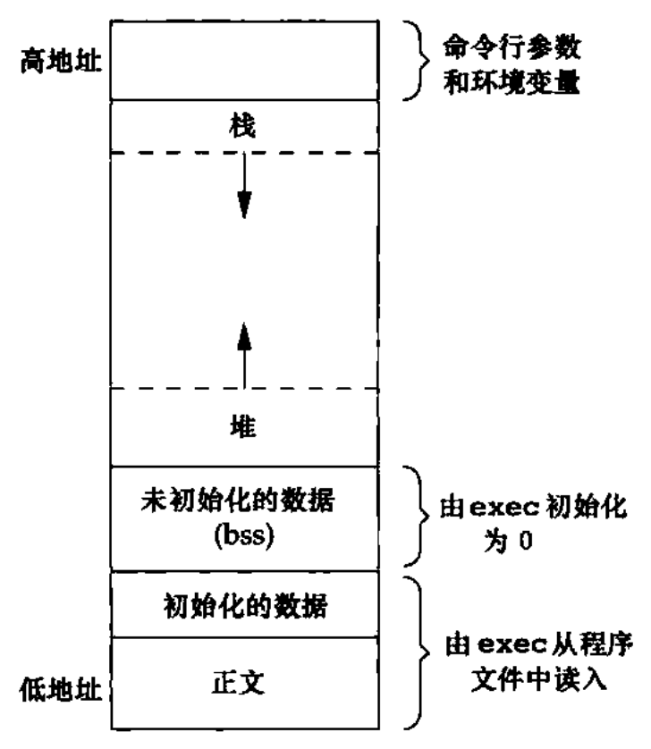
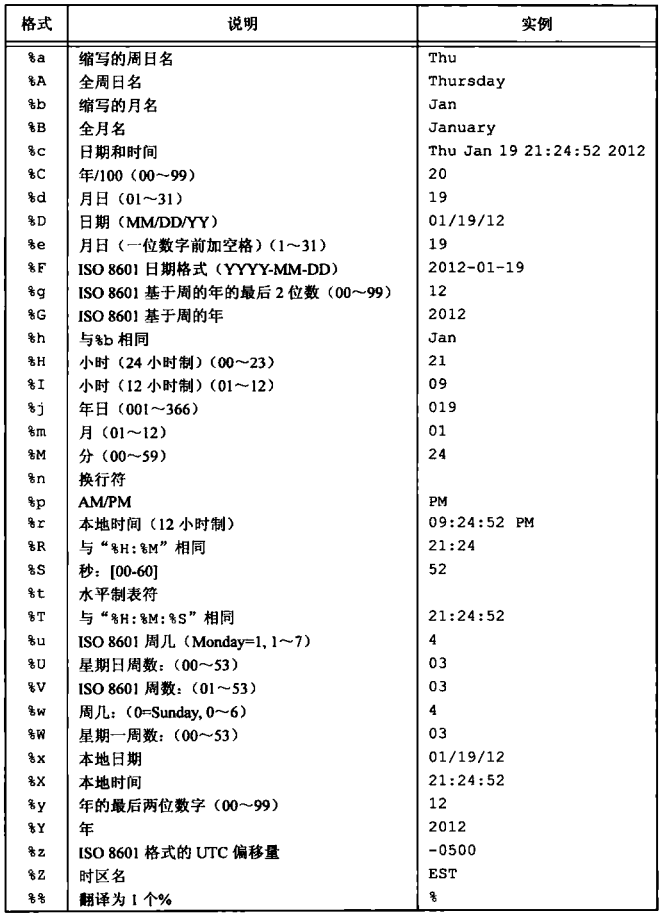
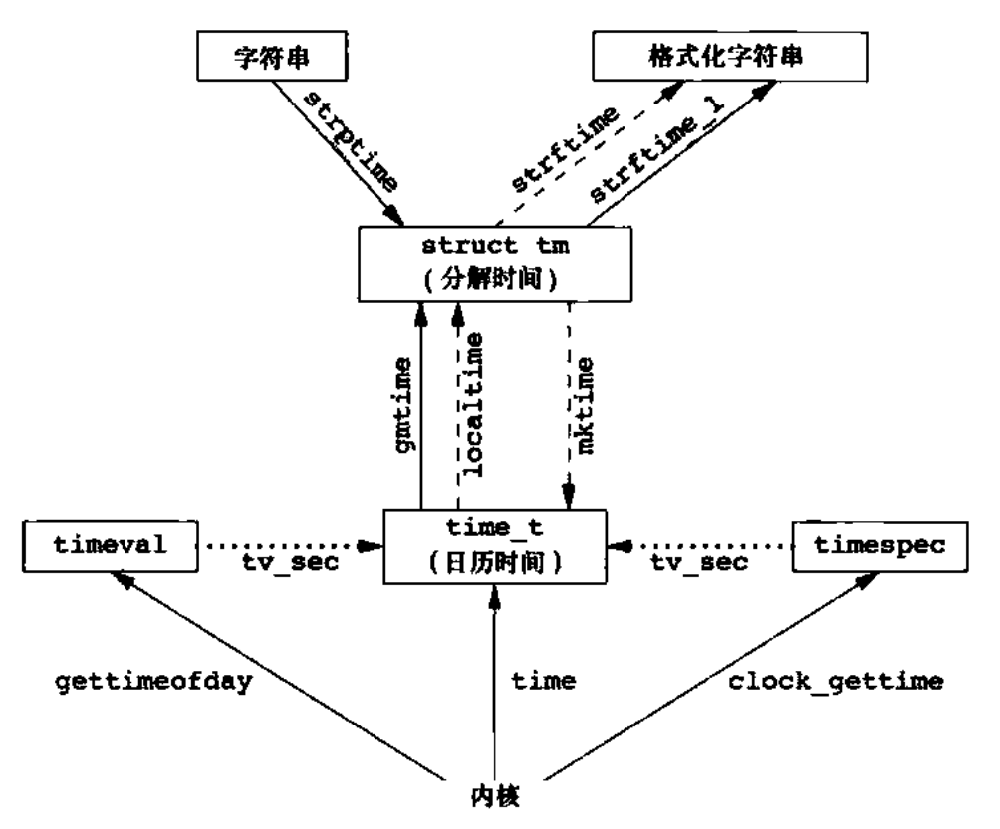

# C语言基础篇

[TOC]



## 一、在C文件中引用C++函数

1. 将要使用的函数声明放在一个头文件中
2. 把要被C语言调用的C++函数的声明放在`extern "C"{ ... }`语句块里
3. 注意：标准C++的头文件包含不能放在`extern "C"{ ... }`语句块里

特别的，若要在C++文件调用C文件的函数也是可行的。

示例如下：

```c++
#ifdef __cplusplus
extern "C" {
#endif

int add(int a, int b);

int sum(int a[], int num);

#ifdef __cplusplus
}
#endif
```

详细实例可见[示例代码](../src/basic/c_use_cpp)

为什么要这么做?

> extern "C"的主要作用就是为了能够正确实现C++代码调用其他C语言代码。<font color='#FF8800'>加上extern "C"后，会指示编译器这部分代码按C语言的进行编译，而不是C++的。</font>由于C++支持函数重载，因此编译器编译函数的过程中会将函数的参数类型也加到编译后的代码中，而不仅仅是函数名；而C语言并不支持函数重载，因此编译C语言代码的函数时不会带上函数的参数类型，一般之包括函数名。

## 二、宏操作——陷阱	

首先需要注意到，宏是C语言中的历史产物，C++中完全继承了C语言中的预处理器和宏操作。但是，还是**尽量不要用宏，改用内联函数或者模板代替**，

因为宏以及处理它的预处理器只是将用宏的地方进行简单的文本替换，根本不会进入symbol table，那么编译器在报错时就会出现魔数情况，这还只是最经常出现的小问题。

大问题在于括号有无或者`++`、`--`等情况，例如：

```C++
#define MAX(a,b) ((a)>(b)?(a):(b))
int i = 0;
int j = 2;
MAX(i++,j++)
```

那么i和j最终等于多少呢？得到的结果又是多少呢？非常烧脑的问题。而且就算我们理清了`i++`了几次，那么当宏的具体实现出现变化，结果可能会出现变化。

又比如：

```C++
#define DOSOMETHING() cmd1; \
					  cmd2; 

if (some_condition()) {
    DOSOMETHING()
}

if (some_condition())
    DOSOMETHING()
```

在定义宏时候，为避免用户使用不当（用户是真的不知道该用上面的哪一种），可以加一个小技巧：

```C++
#define DOSOMETHING() do {cmd1; cmd2; } while(0)
```

此时无论选取那一种写法，都是正确的。此外好处多多，在外部变量很多的时候，使用`do{}while(0);`，在里面可以定义变量而不用考虑变量名会同外部的重复。还有一个好处是，可以避免使用`goto`，使用`do {...} while(0)`当出现错误异常时，直接`break`就行，不需要`goto`。这在程序结构、编译优化上有很多好处。

因此，使用宏一定要在对宏有充分了解的情况下，不然有时候会出现非常多奇怪的问题。

## 三、宏操作——技巧

不过，即使宏的缺点很多，而且可以被内联函数、模板替代，但是仍有存在的意义。

`__FILE__` ：编译的文件的绝对路径；

`__LINE__` ：当前行号；

`__TIME__` ：当前时间；

`__DATE__` ：当前日期。

在定义一个类时候，总会发现在头文件中会有：

```C++
#ifndef XXXX_XXX_XX
#define XXXX_XXX_XX

class {
    // ...
}

#endif XXXX_XXX_XX
```

这是用宏来确保类不会被二次`include`，从而报出重定义的错误。不过也有`#pragma once`这种写法。

还有很多有趣的用法，比如：

```C++
// 字符串连接 将数字变为字符串
#define Con(x, y)  x##y
#define ToString(x) #x

// 用宏来求两个数的最大值  （仍建议使用内联函数）
 /* 通过比较x,y的指针类型，得到警告 若类型一致 通过void消除 */ 
#define max(x, y) ({    \
    typeof(x) _max1 = (x);  \
    typeof(y) _max2= (y);   \
    (void) (&_max1 == &_max2);  \
    _max1 > _max2 ? _max1: _max2;   \
    })

// 使用宏可以快速定义一批变量
#define LIST_OF_VARIABLIES \
        X(value1)  \
        X(value2)  \
        X(value3)
```

具体事例可以参见[如此代码](../src/basic/macro)

## 四、可变参数函数

在编写程序时，我们经常会遇到函数在编译期间接收到的参数数量不确定的情况。比如，经常使用的`printf()`函数，我们可以传入任意数量的参数。那么，这一切究竟如何实现？

事实上，C语言就已经提供了这样的一个解决方案，示例代码在[这里](../src/basic/vargument)：

```C++
int add(int num, ...) {
    va_list valist;
    int sum = 0;
    int i;

    // 为 传入的参数初始化 valist
    va_start(valist, num);

    // 访问 所有的参数
    for(i = 0; i < num; i++) {
        sum += va_arg(valist, int);
    }

    // 结束调用valist 清理内存
    va_end(valist);

    return sum;
}
```

 `add()` 最后一个参数写成省略号，即三个点号（**...**），省略号之前的那个参数是 `int`，代表了要传递的可变参数的总数。为了使用这个功能，需要使用 `stdarg.h` 头文件，该文件提供了实现可变参数功能的函数和宏。具体步骤如下：

1. 定义一个函数，最后一个参数为省略号，省略号前面可以设置自定义参数。

2. 在函数定义中创建一个 `va_list` 类型变量，该类型是在 `stdarg.h` 头文件中定义的。

3. 使用 `int` 参数和 `va_start` 宏来初始化 `va_list` 变量为一个参数列表。宏 `va_start` 是在 `stdarg.h` 头文件中定义的。

4. 使用` va_arg` 宏和 `va_list` 变量来访问参数列表中的每个项。

5. 使用宏` va_end` 来清理赋予 `va_list` 变量的内存。

除此之外，还有一个不被用到的`va_copy`，示例如下：

```C
    va_list valist1;
    va_list valist2;

    va_start(valist1, num);
    // valist2 is dest  after that valist2 equals to valist1
    va_copy(valist2, valist1);

    for (int i = 0; i < num; i++) {
        printf("%d, ", va_arg(valist2, int));
    }

    va_end(valist1);
    va_end(valist2);
```

## 五、C中的类型

C语言中有哪些类型是被重新命名的？它们的用处是什么？本质又是什么呢？

注意：在C++中用到`size_t`或其他在C中定义的类型时，推荐使用`#include<stddef.h>`。

| 类型                        | 实质                  | 描述                                                         |
| --------------------------- | --------------------- | ------------------------------------------------------------ |
| ptrdiff_t                   | signed int            | 两个指针相减的结果的有符号整数类型                           |
| size_t                      | unsigned int          | 通常用于数组的索引以及表示变量存储空间的大小                 |
| wchar_t                     | int                   | 宽字节字符类型，可以表示，在支持的语言环境中，指定的最大扩展字符集的所有成员 |
| nullptr_t<sup>C++11</sup>   | 关键字`nullptr`的类型 | 该类型表示它不是指向某个东西的指针类型，当多个重载函数接收不同的指针类型时，重载一个接收`std::nullptr_t`用于处理传入null指针的情况 |
| max_align_t<sup>C++11</sup> | 实现定义              | 一种对齐要求，至少与每个标量类型一样严格（大）的类型         |
| NULL                        | 宏 （void*) 0 or 0    | C语言中表示空指针，但在C++中仅表示0，C++中的空指针推荐使用`nullptr` |

## 六、GNC C中的Attributes

在GNC C中，可以将你要调用的函数用“特殊的东西”声明，可以帮助编译器优化你的函数，并可以帮你挑出一些更加细微的错误。

那么这些**特殊的东西**，就是这里介绍的关键字`__attribute__`了。在声明时，它可以帮你给函数设定一个特殊的属性。这个关键字通常会带有如下几个东西：

- noreturn

  ```c
  void err_sys(const char * fmt, ...) __attribute__((noreturn))
  ```

  通常用在一些标准库函数中，例如`abort`或者`exit`，意思是不能`return`，GCC会得知这一点，并且GCC就会对其进行优化：**不会考虑如果`err_sys`出现返回值的情况**。更重要的是，可以避免出现未初始化变量的警告。

- noinline

  阻止函数内联。

事实上，GCC的attribute有三大类：

* Function attributes described [here](http://gcc.gnu.org/onlinedocs/gcc/Function-Attributes.html)
* Variable attributes described [here](http://gcc.gnu.org/onlinedocs/gcc/Variable-Attributes.html)
* Type attributes described [here](http://gcc.gnu.org/onlinedocs/gcc/Type-Attributes.html)

这里就不一一介绍了。

## 七、Linux下的命令行处理

执行程序时，可以从命令行传值给 C 程序。这些值被称为**命令行参数**，它们对程序很重要，尤其是从外部控制程序的执行。命令行参数是使用 `main()` 函数参数来处理的，其中，**argc** 是指传入参数的个数，**argv[]** 是一个指针数组，指向传递给程序的每个参数。下面是一个简单的实例，检查命令行是否有提供参数，并根据参数执行相应的动作：

```C
#include <stdio.h>

int main(int argc, char *argv[]) {
   if (argc == 2)
      printf("The argument supplied is %s\n", argv[1]);
   else if (argc > 2)
      printf("Too many arguments supplied.\n");
   else
      printf("One argument expected.\n");
}
```

使用一个参数，编译并执行上面的代码，它会产生下列结果：

```bash
$./a.out testing
The argument supplied is testing
```

为了方便处理，Linux 提供了一系列函数帮助用户更好更快地解析命令行传来的参数。

`getopt()`函数：`optstring`是一个简单字符列表，每个字母代表一个选项。

```c
#include <unistd.h>

int getopt(int argc, char *const argv[], const char *optstring);

extern char *optarg;
extern int optind, opterr, optopt;
```

这个函数的返回值很有意思：

- 如果处理的 option 成功，那么返回选项的字母，如果有值跟随，那么字符串会被放在`optarg`中。
- 如果处理的 option 需要一个值，但命令行中没有给定值，返回 ：
- 如果处理了一个未知的 option ，返回 ？，并将值存入到`optopt`
- 如果没有更多的 option 等待处理，返回-1
- 如果多余出一些跟随值，那么会将多余的存放在`argv`数组中，`optind`和`argc`分别充当索引和大小。

那么`optstring`要怎么写呢？

```C
char *optstring = "ab:c::";
// 单个字符a       表示选项a 没有参数   -a即可
// 单个字符加冒号b: 表示选项b 必须有参数 -b 10
// 单个字符加两个冒号c:: 表示选项c可有可无参数
```

具体示例[程序](../src/basic/cmd/getopt.c)。

`getopt_long()`函数与`getopt_long_only()`函数，它们的工作方式与`getopt()`函数很像，除了这些函数还可以接收（`getopt_long_only()`除外）长选项`--`，形式可以为`--arg=param`或者`--arg param`。

```c
int getopt_long(int argc, char *const *argv, const char* shortopts, 
                const struct option *longopts, int longind);
// 其中结构体option
struct option {
    const char *name;		// name of ong option
    int         has_arg;	// 0 no 1 required 2 optional
    int        *flag;		// how results returned
    int 		val;        // value to return
}
```

具体示例见[程序](../src/basic/cmd/getopt_long.c)

## 八、Linux下的时间处理

Linux内核提供的基本时间服务是计算自协调世界时（UTC）公元1970年1月1日 00:00:00 这一特定时间以来经过的秒数。这种秒数用` time_t `数据结构表示。

`time()`函数返回当前的秒数。

```C
#include <time.h>

time_t time(time_t *calptr);
```

时间值作为函数值返回。若参数非空，时间值也会放在`calptr`指向的值中。

`clock_gettime()`函数可以用于获取指定时钟的时间，返回的时间在`timespec`数据结构中，它将时间分为秒和纳秒。`clock_id`用于指示选项，常用的有`CLOCK_REALTIME`、`CLOCK_MONOTONIC`、`CLOCK_PROCESS_CPUTIME_ID`。

```C
#include <sys/time.h>

int clock_gettime(clockid_t clock_id, struct timespec *tsp);
int clock_getres(clockid_t clock_id, struct timespec *tsp);
int clock_settime(clockid_t clock_id, struct timespec *tsp);
```

`clock_getres`函数把`tsp`指向的`timespec`结构初始化为`clock_id`参数对于的**时钟精度**。我们还可以使用`clock_settime`函数设置时间，但有些时钟不能修改。

以上这些函数得到的数字都是自UTC时间的秒数，这对人类非常不友好。需要用`localtime`、`gmtime`、`strftime`等函数将秒数转为可读时间。`localtime`和`gmtime`将时间转换存入到结构体`tm`中。而`mktime`函数将tm时间转换为秒数。

```C
#include <time.h>
struct tm {
    int tm_sec;		// [0-60] 允许润秒
    int tm_min;		// [0-59]
    int tm_hour;	// [0-23] 
    int tm_mday;	// [1-31]
    int tm_mon;		// [0-11]
    int tm_year;	// years since 1900
    int tm_wday;	// [0-6]
    int tm_yday;	// [0-365]
    int tm_isdst;	// daylight saving time flag
}

struct tm *gmtime(const time_t *calptr);
struct tm *localtime(const time_t *calptr);

time_t mktime(struct tm *tmptr);
```

当然，`gmtime`和`localtime`函数仍然不能满足人们的需要。函数`strftime`是类似于`printf`的时间值函数，可以通过多个参数定制产生的字符串。

```C
#include <time.h>

size_t strftime(char *buf, size_t maxsize, const char *format, 
                const struct tm *tmptr);
size_t strftime_l(char *buf, size_t maxsize, const char *format, 
                  const struct tm *tmptr, locale_t locale);
char *strptime(const char *buf, const char *format, struct tm *tmptr);
```

`tmptr`是要格式化的时间值，格式化的结果存放在长度为`maxsize`的`buf`数组中，如果长度不足，函数返回0，否则返回在 `buf` 中存放的字符数。`format`是控制时间值的格式，与`printf`相同。

这是使用说明：



`strptime`是`strftime`的反过来的版本，把字符串时间转换为分解时间。

这些函数的转换关系，可以用这一张图概括：



## 九、setjmp 和 longjmp

C语言中，goto语句是不能跨函数的，执行跨函数跳转功能的是函数 `setjmp` 和 `longjmp` 。这两个函数在处理**发生在很深的嵌套函数调用中的出错情况**是非常有用的。

先来看一下下面的程序示例，引出问题：

```c
int main() {
    /* ... */
    while(fgets(line, MAXLINE, stdin) != NULL)
        do_line(line);
    /* ... */
}

void do_line(char *ptr) {
    /* ... */
    while((cmd = get_token()) > 0)
        cmd_add();
}

void cmd_add() {
    /* ... */
}

int get_token() {
    /* ... */
}
```

可以发现，该程序有非常多的函数调用，嵌套多层，设想若在 `cmd_add` 函数发现一个错误，需要返回 `main` 函数并读下一个输入行，我们就不得不检查函数返回值逐层返回，那就会变得非常麻烦。

使用 `setjmp` 和 `longjmp`函数，可以使程序在栈上跳过若干调用帧，返回到当前函数调用路径上的某一个函数。

```C
#include <setjmp.h>

int setjmp(jmp_buf env);
void longjmp(jmp_buf env, int val);
```

在希望返回到的位置调用 `setjmp`，`setjmp` 的参数 `env` 的类型是 `jmp_buf` 。这一数据类型是某种形式的数组，用于存放在调用 `longjmp` 函数时，用来恢复栈状态的所有信息。通常 `env` 为全局变量，因为需要在另一个函数中使用。

```c
jmp_buf jmpbuffer;
int main() {
    /* ... */
    if (setjmp(jmpbuffer) != 0)
        printf("error\n");
    while(fgets(line, MAXLINE, stdin) != NULL)
        do_line(line);
    /* ... */
}

void cmd_add() {
    if ((token = get_token()) < 0)	// error occurred
        longjmp(jmpbuffer, 1);
}
```

当一个错误发生，`longjmp` 函数就会被调用，其中第二个函数参数 `val`将成为从 `setjmp` 处返回的值。显然，对于一个 `setjmp` 可以有多个 `longjmp`。返回的值是用户自己设计的，